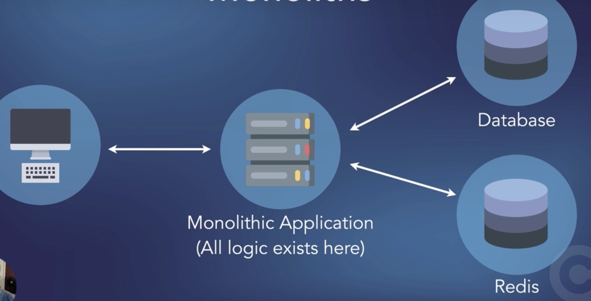
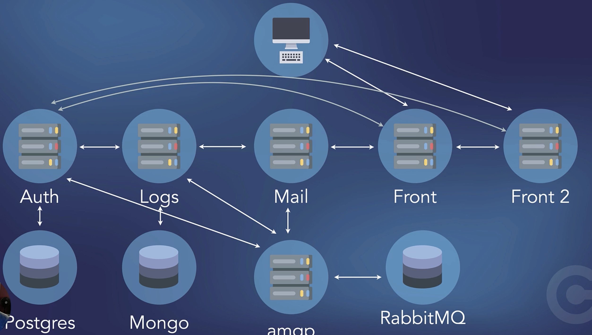
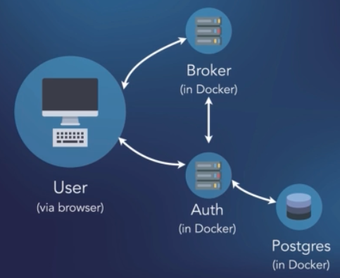
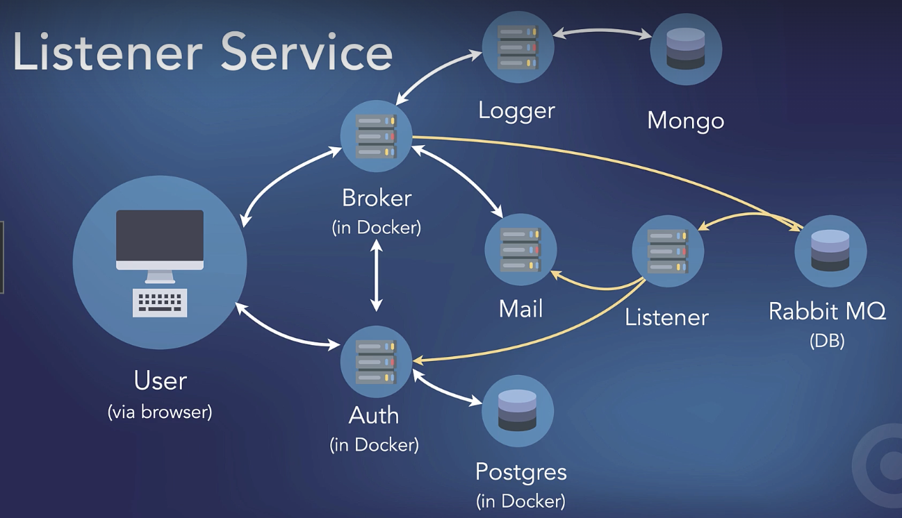
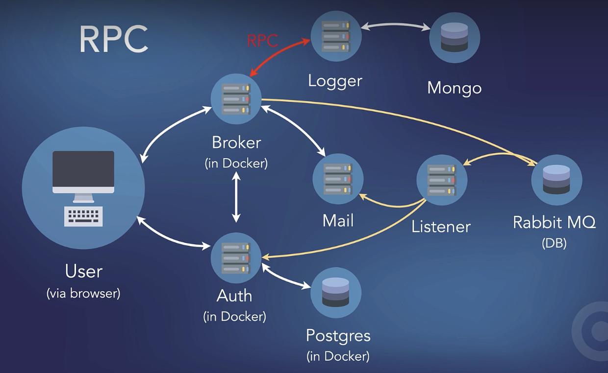
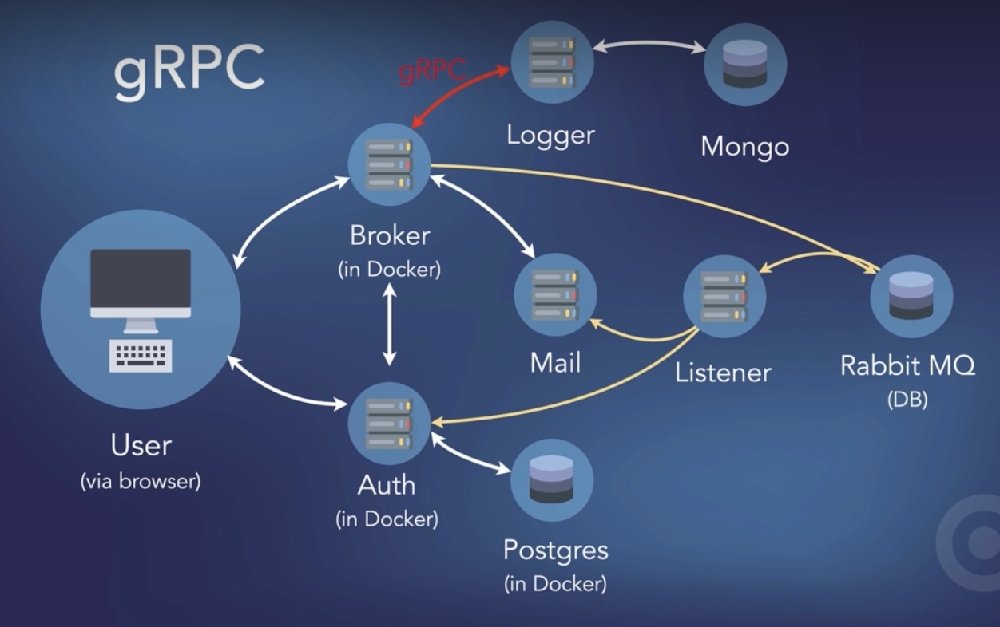
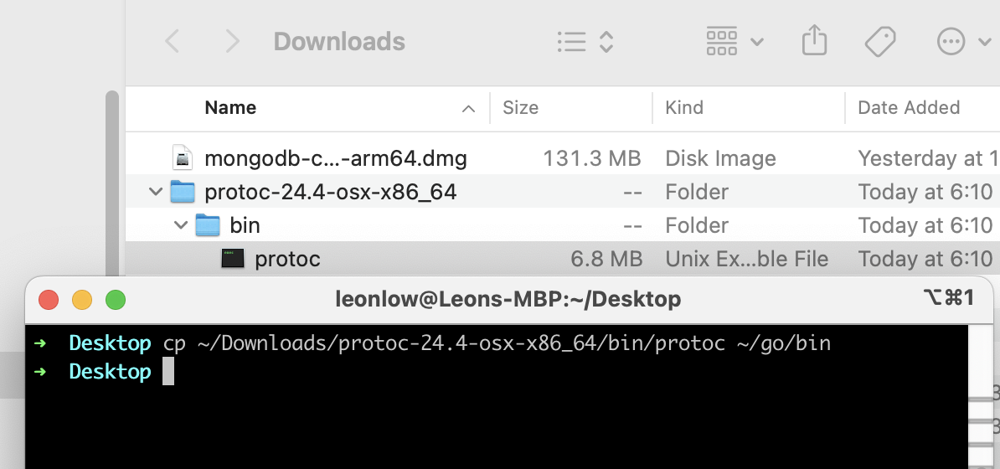

## Microservices

- Monolithic applications: all of your business logic, connection to database, authentication, sending email or logging, is built into a single application.
- Distributed applications: instead of having 1 big monolith, you have many smaller applications that do 1 thing and do it well.
- Microservices, also known as the microservice architecture, are an architectural style which structures an application as a loosely coupled collection of smaller applications. The microservice architecture allows for the rapid and reliable delivery of large, complex applications.
  - Microservices
    - Maintainable and Testable
    - Breaking monolith up from functions/packages to completely separate programs.
    - Communicate via JSON/REST, RPC, gRPC, and over a messaging queue
    - Easy to scale and can be deployed independently.
    - Organized around business capabilities
    - Often owned by a small team

### Monolithic Architecture



### Project Specifications



- A frontend web application that connects to 5 microservices:
  - **Broker**: optional single point of entry into the microservice cluster (microservices). (In Docker image)
  - **Authentication**: with a Postgres database
  - **Logger**: with a MongoDB database
  - **Mail**: takes a JSON payload, converts into a formatted email, and send it out
  - **Listener**: receives messages from RabbitMQ and acts upon them
- Communicate from between Microservices using:
  - REST API with JSON as transport
  - Sending & Receiving using RPC
  - Sending & Receiving using gRPC
  - Initiating and responding to events using Advanced Message Queuing Protocol (AMQP) with RabbitMQ

### Authentication Microservice



- Adding an Authentication Microservice that will be called by the Broker Service.
- There is a link between the browser and the Authentication Microservice (not a common practice and usually it will be called by the Broker Service).

### Logger Microservice

- Logger Service has no connection to Internet and is only available within the Microservice Cluster. This cluster can be
  - Docker
  - Docker Swarm
  - Kubernetes Cluster
- Logger Service stores all its information in Mongo (NoSQL) Database.
- Added a logging service in authentication microservice
  - Whenever someone logs in successfully or logout, it will create a log entry.

### Helpful Links

- [Relation table not created in Docker container](https://rajyavardhan.medium.com/when-you-get-relation-does-not-exist-in-postgres-7ffb0c3c674b)
- [StackOverflow - Slow Queries between server and database in Docker](https://stackoverflow.com/questions/65875996/very-slow-queries-between-server-and-database-in-docker)
- [Bind Mounts vs Volumes](https://docs.docker.com/storage/volumes/)
- [Blog on Docker volumes vs Bind mounts](https://blog.logrocket.com/docker-volumes-vs-bind-mounts/)

### Mail Service

- In this project (development), we are allowing the user to press "Test Mail" and send an email to the mail server (open to the Internet, Bad!).
- In Production, Service should not communicate with Internet.
  - For example, if you want to send an email when someone unsuccessfully logs on to the system, broker will communicate with authentication service. The authentication service will then talk to the mail service saying the user is not authenticated and then send out an email. Every microservice that needs to send an email will communicate with the mail microservice. The broker service (directly connected to user's browser/internet), is not allowed to communicate directly to the mail microservice, for security purposes and prevention of spam mails.
  - Put inside Docker Swarm or Kubernetes Cluster
- Create a Mail Server (MailHog - for development)

### Listener Service (RabbitMQ - AMQP)



- Listener Service that talks to RabbitMQ (AMQP)
- If someone wants to authenticate and sends a request to the broker, the broker doesn't communicate directly with the authentication service.
  - The Broker pushes the message to RabbitMQ (AMQP Server)
  - Listener pulls a message out of the queue and calls the appropriate service based on the content in the message.
  - Listener then sends a request to the authentication service and attempts the login.
- E.g., Request --> Broker Service (publisher) --> RabbitMQ --> Listener Service (subscriber) --> Log/Authentication Microservice

### RPC (Remote Procedure Call)



- Communication between services (client and server) must be in the **same programming language**, e.g., Go.
  - If broker service uses RPC in Python and Logger uses Go, it won't work.
- RPC has better performance because it is faster than marshaling and un-marshaling JSON.

### gRPC (Google RPC)



- Client and server can be written in different programming languages.
- gRPC uses protobuf
  - It is where you store your data and function contracts in the form of a proto file.
  - As this is in the form of a contract, both the client and server need to have the same proto file.
- In VSCode, install "Protobuf support" extension for nicer highlighting in `.proto` file.

---

#### Process:

1. Define a protocol (proto file)
2. Compile the protocol using the 2 things we install below.
3. Write the client code
4. Write the server code

---

#### Protocol Buffer Compiler Installation

- [Protocol Buffer Compiler Installation](https://grpc.io/docs/protoc-installation/)
- [GitHub Link (Recommended)](https://github.com/protocolbuffers/protobuf/releases)
  - `protoc-3.20.0-osx-x86_64.zip` for MacOS



```
## Run this in command line to install protobuf in Go
go install google.golang.org/protobuf/cmd/protoc-gen-go@v1.27

go install google.golang.org/grpc/cmd/protoc-gen-go-grpc@latest

brew update
brew upgrade
brew install protobuf

which go
cp /opt/homebrew/bin/protoc ~/go/bin
protoc --version

export PATH="$PATH:$(go env GOPATH)/bin"

## Will create 2 files --> logs_grpc.pb.go and logs.pb.go
protoc --go_out=. --go_opt=paths=source_relative --go-grpc_out=. --go-grpc_opt=paths=source_relative logs.proto
```

```
go get google.golang.org/grpc
```

---

### Docker Swarm

- [Docker Swarm](https://docs.docker.com/engine/swarm/)
- Container Orchestration Service
- Can deploy 1 or more instances of Docker images and Docker Swarm will manages.
- Easy to scale your microservices.

```
// Push images to DockerHub
docker build -f logger-service.dockerfile -t lowjiewei/logger-service:1.0.0 .
docker push lowjiewei/logger-service:1.0.0

docker build -f broker-service.dockerfile -t lowjiewei/broker-service:1.0.0 .
docker push lowjiewei/broker-service:1.0.0

docker build -f authentication-service.dockerfile -t lowjiewei/authentication-service:1.0.0 .
docker push lowjiewei/authentication-service:1.0.0

docker build -f mail-service.dockerfile -t lowjiewei/mail-service:1.0.0 .
docker push lowjiewei/mail-service:1.0.0

docker build -f listener-service.dockerfile -t lowjiewei/listener-service:1.0.0 .
docker push lowjiewei/listener-service:1.0.0
```

### Kubernetes

- Replacing `broker-service` with Kubernetes `LoadBalancer` Service.
  - `kubectl delete broker-service`
  - Then, running the following command to export the Kubernetes Cluster to the outside world using a `LoadBalancer` service. In Production, we typically use an `Ingress` Service.
  - `kubectl expose deployment broker-service --type=LoadBalancer --port=8080 --target-port=8080`
- Running separate postgres server
  - `docker-compose -f postgres.yml up -d` in `project` directory
- Adding `Ingress` to minikube
  - `minikube addons enable ingress`
- After adding `ingress.yml` file
  - Run `kubectl apply -f ingress.yml`
  - Run `sudo vi /etc/hosts`
    ```
    # add the following into the /etc/hosts file
    127.0.0.1     front-end.info broker-service.info
    ```
  - Run `minikube tunnel`
  - Access `http://front-end.info/` on browser
- Scaling in Kubernetes
  - Increase `replicas` in `spec` as the declarative deployment approach
- Updating Services
  - Scale to 2 replicas first then apply image tag change, this ensures that the old image is still running and the application is not affected while the old pod is terminating
  - E.g., Make changes to the image, change the image tag from `1.0.0` to `1.0.1`
  - Then run `kubectl apply -f k8s`
- [How To Configure Ingress TLS/SSL Certificates in Kubernetes](https://devopscube.com/configure-ingress-tls-kubernetes/)
