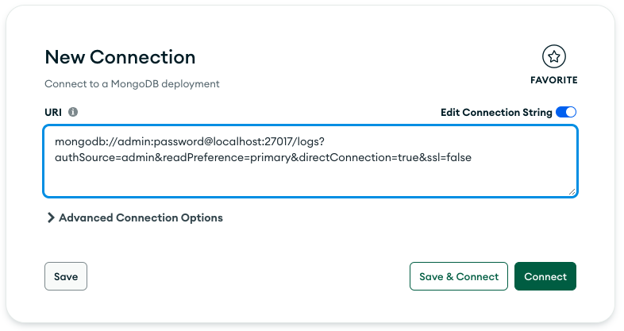

## Mongo

```
go get go.mongodb.org/mongo-driver/mongo
```

### MongoDB Compass Download Link

- [MongoDB Compass Link](https://www.mongodb.com/try/download/compass)




## Starting Mongo Microservice Locally (`localhost`)

- If running on `localhost` and see the error below, port 5000 is being used locally, change `webPort` to something else.

```
2023/10/28 11:06:44 Connected to Mongo!
2023/10/28 11:06:44 Starting service on port 5000
2023/10/28 11:06:44
panic:

goroutine 1 [running]:
log.Panic({0x0?, 0x3?, 0xc00020fe50?})
        /usr/local/go/src/log/log.go:388 +0x65
main.main()
        /Users/leonlow/Desktop/udemy/go-microservices/trevor_sawler/logger-service/cmd/api/main.go:63 +0x345
exit status 2
```

- To run locally, modify these variables:

```go
const (
	webPort  = "5050" // docker
	rpcPort  = "5001"
	mongoURL = "mongodb://localhost:27017"
	gRpcPort = "50001"
)
```
